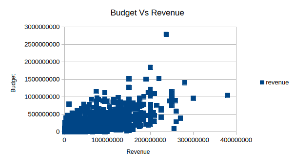
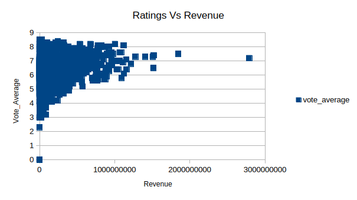
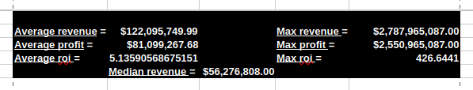
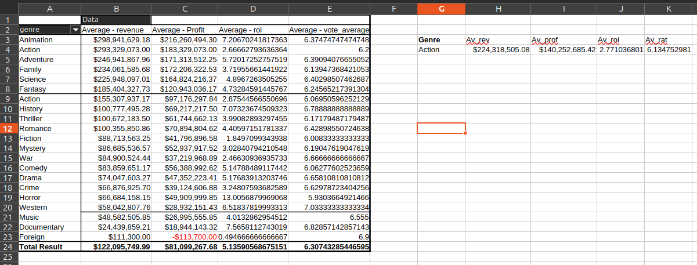
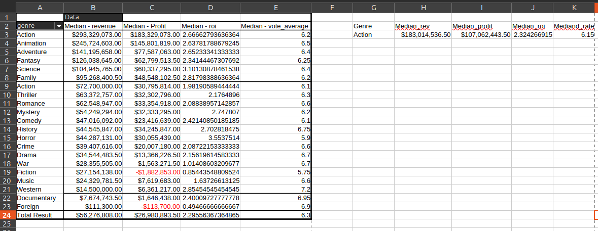

# 🎬 Movie Success Analysis

## Overview
This project analyzes a dataset of over 3,200 movies to identify the key factors that drive movie success. The analysis focuses on financial performance, audience engagement, and genre-based trends using Excel.

---

## Objectives
- Understand what defines a successful movie  
- Analyze the relationship between budget and revenue  
- Evaluate the impact of ratings on revenue  
- Identify the most profitable and efficient movie genres  

---

## 📊 Dataset
- Source: Kaggle (TMDB Movie Dataset)  
  [Raw Dataset](Raw_data.csv) 

- Initial size: ~4800 movies  

- Cleaned dataset: 3203 movies  
  [Clean Data](Clean_data.ods)

---

## Data Cleaning
Several preprocessing steps were performed to ensure data quality:

- Removed irrelevant columns  
- Removed movies with missing or zero budget/revenue  
- Handled missing or inconsistent entries in key columns  
- Simplified complex genre data into a single primary genre  
- Removed movies with budget < 100,000  
- Created new features:
  - Profit = Revenue − Budget  
  - ROI (Return on Investment) = Revenue / Budget  
  - Release Month extracted from release date  

Approximately **33% of the data was removed**, primarily due to missing financial values. This ensures more reliable analysis, particularly for profit and ROI calculations.

---

## Analysis

### Budget vs Revenue

The analysis reveals a positive relationship between budget and revenue. However, the relationship shows high variability, indicating that while higher budgets increase the potential for higher revenue, they do not guarantee success.

---

### Ratings vs Revenue

There is a weak positive relationship between audience ratings and revenue. This suggests that ratings alone are not a strong predictor of financial success. High-quality movies do not always generate the highest revenue.

---

### Summary Statistics

The comparison between mean (~ $122M) and median (~ $56M) revenue indicates that the data is right-skewed. A small number of blockbuster movies significantly influence the average.

The mean ROI (~5.14) indicates that, on average, movies generate approximately five times their production budget. However, the maximum ROI (~426) reveals the presence of extreme outliers. To mitigate their impact and ensure more reliable analysis, the dataset was filtered to include only movies with a budget greater than or equal to 100,000.

---

### Genre Analysis
**Average Metrics by Genre** 

 

**Median Metrics by Genre** 

Genre-based analysis reveals:

- Animation movies have the highest average (~ $298M) and median (~ $293M) revenue, indicating strong and consistent performance  
- Documentary movies have the highest average ROI (~ 7.57), likely due to low production costs  
- Western movies have the highest median ROI (~ 2.85), suggesting consistent efficiency  

Animation movies represent only about **3% of the dataset**, so their strong performance should be interpreted with caution.

---

## Key Insights
- Higher budgets increase revenue potential but do not guarantee success  
- Audience ratings have limited influence on financial performance  
- A small number of blockbuster movies significantly impact averages  
- Different genres achieve success in different ways:
  - Animation → high revenue performance  
  - Documentary → high ROI potential  
  - Western → consistent ROI efficiency  
- Success should be evaluated using multiple metrics, including profit and ROI  
----

##  Tools Used
- Microsoft Excel  
  - Data Cleaning  
  - Feature Engineering  
  - Pivot Tables  
  - Data Visualization  

---

# Conclusion
[analylis](tmdb_5000_movies.ods)

Analysis shows that annimation movies (3% of the data) consistently generate the highest revenue, both in average and median, indicating strong and stable financial performance for the genre. In contrast, Documentary films achieved the highest average ROI, likely due to low production costs, although this may be influenced by variability. Western films exhibit the highest median ROI, suggesting more consistent efficiency in investment returns. These findings highlight that different genres achieve success through different financial dynamics, emphasizing the importance of evaluating both revenue and efficiency metrics. While high-budget productions can generate significant revenue, smaller-budget films may deliver better returns on investment. 

